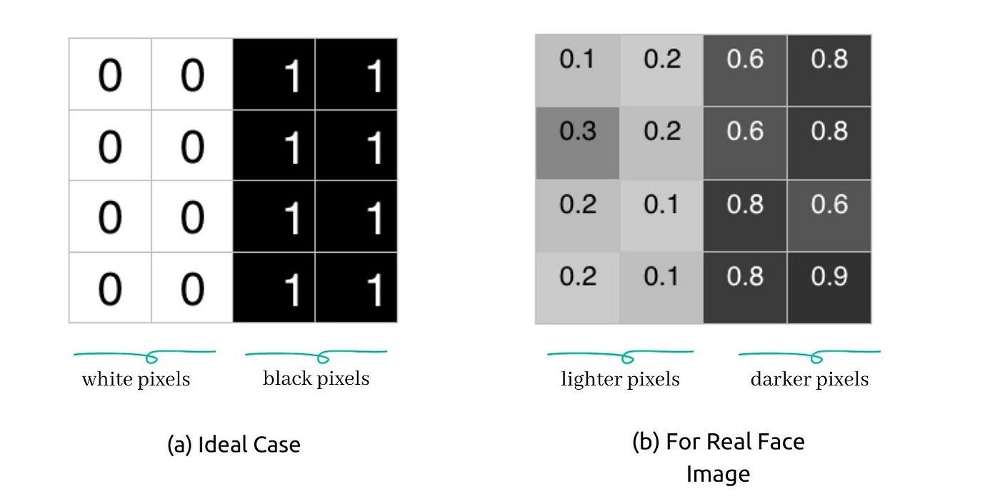
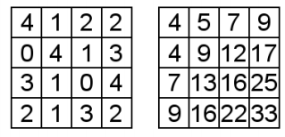

# Viola Jones Video Anonymizer

**An implementation of Viola Jones based face Detection Algorithm for the purpose of Anonymizing videos**

---

**Theoretical Topics:** *Computer Vision, Viola Jones*

**Tools / Technologies:** *Python, OpenCV, gTTS*

---

### Technical Explanation:

Viola Jones Video Anonymizer  -- [app.py](https://github.com/harshp30/ViolaJonesVideoAnonymizer/blob/main/app.py)

*What is the Viola Jones Algorithm?*

> The Viola–Jones object detection framework is a machine learning object detection framework. It was motivated primarily by the problem of face detection

Much like the application of it on this project, the Viola Jones algorithm is designed as a face detection algorithm

The algorithm works by focusing on the relevant features of a human face such as eyes, mouth, ears, forehead, etc.

One important note is that the algorithm only handles grayscale images so (as mentioned below) it is a vital step of the video manipulation process

Below outlines the general processes and points for the Viola Jones Algorithm:

- The algorithm works by iterating through the frames of an image checking for relevant features found within the frame
- We use Haar-Features which are a sequence of squared shaped functions used to detect edges and lines which help with feature detcetion
    - We have an ideal case for a Haar function and a more realistic case for real life purposes
    - The Viola Jones Algorithm compares how close the real scenario is to the ideal case
    - `△ = dark - white = 1/n * Σ[n, dark]I(x) - 1/n * Σ[n, white]I(x)`
    - The closer `△ = 1` the more liekly it is a Haar Feature
    
- We then use Inteagral images because with just using Haar Features the itme complexity of the function ends up being `O(N^2)` since we calculate regions several time
    - For that reason we use integral images to bring down the time complexity to `O(1)`
    - > It is a data structure and algorithm for quickly and efficiently generating the sum of values in a rectangular subset of a grid

        
    
    - It is a diagonal sum of values across an image

- Lastly we perform Cascading to further optimize the algorithm
    - We first perform Boosting to find the best features of the given images through a itertaive process, we don't have to use all ~6000 Haar features if we optimize the figure the most important ones
    - Instead of focusing on finding regions with rleevant features we see if a given region does not contain relative features, if this appears to be true we don't revisit that region for the image
    - This is known as the Cascade Classifier

With these steps the Viola Jones algorith is able to quickly and effectively detcet faces within images and this is the algorithm used for this application.
    

*Explanation*

This project is a end to end video anonymizer handling both the video and audio to theoretically hide the identity of the person talking in the video. 

Below I have explained each of the components individually...

1. Video -- `extract_video()` and `convert_video()`

    Within the video extraction function we first initialize the Viola Jones Algorithm and the original input mp4 file using cv2

    We then iterate through each frame of the video and treat it like it's own individual image where we...
    - Read the image
    - Convert it to grayscale (Needed for Viola Jones)
    - Run the Viola Jones Algorithm on the image
    - Locate the rectangle bounding box around the detected face
    - Apply a Gaussian Blur to that region

    We perform these steps for each frame and record each image and merge them together to create a singular output .avi file. This file is then converted to a mp4 using the convert video function

    We end up with a no sound mp4 file with the original video where the person's face has a blur mask on it

2. Audio -- `extract_audio()`

    My intial idea was I wanted to change the voice in the video into something robotic so it would be undistinguisable. In order to achieve this I performed the following steps...

    - Using MoviePy I extracted the audio from the original mp4 file
    - I then used the speech recognition library to convert the audio into a transcript.
    - I then used google text to speech to convert the transcription text into english audio which comes out very robotic
    - Finally, I saved this gTTS generated output audio as a mp3 file

    With these steps I was able to achieve what I wanted with the audio portion of the original video

3. Combining -- `combine_audio_video()`

    The final step was to merge the gTTS geenrated audio the Viola Jones overlayed video in order to create the final output mp4 file

    I used ffmpeg to merge the two files together and outputted a mp4 file names based on the users preferred ouput file name

    After this step the process was complete. The user at the start inputted a mp4 file and at the end recieved that a mp4 file with robotic audio and a blurred face mask

*Demo*

Below is a video demonstration of the Anonymizer

    
---

### Next Steps:

- Use a different CV technique rather then just viola Jones to deal with non-frontal face detection
- Use a better text to speech geenrator to sound more human and have more customization

---

### Additional Notes:

- Video Clip Credit: https://youtu.be/Sfa5AcNSBqg
- The input original mp4 clip and final (output) mp4 clip are attached to the repo and can be viewed through the demo above
- The Viola Jones Algorithm uses pre-trained weights held in a XML file. I have attached that as a part of the repo
